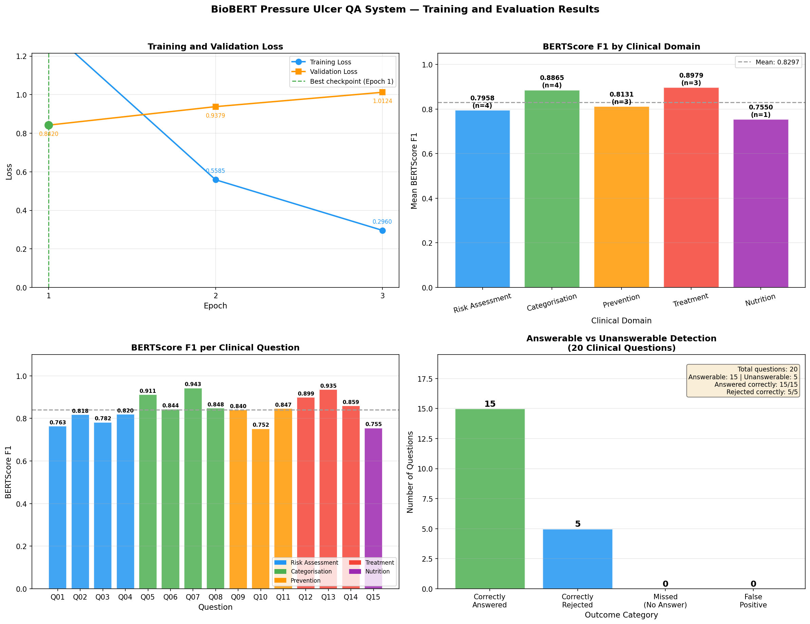

# BioBERT Pressure Ulcer Clinical QA System

A retrieval-augmented extractive question answering system that enables 
healthcare practitioners to ask natural language questions about pressure 
ulcer care and receive answers extracted directly from verified NHS 
clinical guidelines.

Built as part of MSc Artificial Intelligence (Machine Learning) at 
Liverpool John Moores University — 7146COMP Advanced Topics in Deep Learning.

---

## What It Does

A nurse can ask:

> *"What defines a Category 4 pressure ulcer?"*  
> *"How often should a high-risk patient be repositioned?"*  
> *"What dressing is recommended for a Category 2 pressure ulcer?"*

The system retrieves the most relevant passage from a verified clinical 
knowledge base and extracts a precise answer span — traceable to its 
source document. When a question falls outside the scope of the knowledge 
base, the system returns a structured no-answer response rather than a 
confident but potentially incorrect clinical recommendation.

---

## System Architecture

```
Clinical Documents → Text Extraction → Chunking → QA Generation
        ↓
    SQuAD 2.0 Dataset (3,379 pairs)
        ↓
    BioBERT Large Fine-tuning
        ↓
FAISS Semantic Index ← S-PubMedBert-MS-MARCO Encoder
        ↓
    Inference Pipeline (Top-5 Retrieval + Keyword Validation)
        ↓
    Answer Span + Confidence Score + Source Document
```

---

## Key Results

| Metric | Value |
|--------|-------|
| BERTScore F1 (test set) | 0.9342 |
| BERTScore Precision | 0.9382 |
| BERTScore Recall | 0.9322 |
| Token F1 | 64.13% |
| Exact Match | 31.14% |
| Clinical questions answered | 15/15 (100%) |
| Unanswerable detection | 5/5 (100%) |



---

## Knowledge Base

74 authoritative clinical documents downloaded programmatically from:

- **NICE** — CG179 and QS89 including all quality statement chapters
- **NHS England** — Core curriculum, reporting guidance, Stop the Pressure
- **NWCSP** — National Wound Care Strategy Programme clinical pathway 2023
- **NHS Trusts** — Tissue viability policies from trusts across England, Scotland, and Wales including DBTH, LPT, BSMHFT, TEWV, WWL, CNTW, NHS GGC Scotland, NHS Lothian, NHS Grampian
- **Wounds UK** — Best practice statements
- **NPUAP/EPUAP** — International clinical practice guidelines
- **Targeted peer-reviewed evidence** — Braden scale validation, repositioning frequency, dressing efficacy, nutritional support, nurse education

Total corpus: 625,400 words across 2,109 chunks

---

## Dataset Construction

- **Source documents:** 74 downloaded, 71 successfully extracted
- **QA generation:** Claude Haiku with verbatim grounding validation
- **Generation passes:** Two-pass strategy — initial pass + second pass on productive chunks
- **Quality filtering:** Verbatim grounding check, length validation, format check, deduplication
- **Final dataset:** 3,379 pairs (3,034 answerable + 345 unanswerable)
- **Format:** SQuAD 2.0 with 70/15/15 train/validation/test split

---

## Model

- **Base model:** dmis-lab/biobert-large-cased-v1.1-squad
- **Parameters:** 363,251,714
- **Fine-tuning:** AdamW, lr=2e-5, batch=16, 3 epochs with early stopping
- **Best checkpoint:** Epoch 1 (val_loss=0.8420)
- **Hardware:** NVIDIA RTX 3090 25.8 GB

---

## Retrieval Pipeline

- **Encoder:** pritamdeka/S-PubMedBert-MS-MARCO
- **Index:** FAISS IndexFlatIP (exact cosine similarity search)
- **Strategy:** Top-5 retrieval with keyword relevance validation
- **No-answer detection:** SQuAD 2.0 CLS token comparison + confidence threshold 0.55

---

## Project Structure

```
├── task1_dataset_construction.ipynb   # Knowledge base + QA dataset
├── task2_data_preprocessing.ipynb     # Tokenisation + feature extraction  
├── task3_model_training.ipynb         # BioBERT fine-tuning
├── task4_evaluation_deployment.ipynb  # Inference + evaluation
├── knowledge_base/                    # Downloaded clinical documents
├── preprocessed/                      # Tokenised PyTorch datasets
├── biobert_pressure_ulcer_best/       # Best model checkpoint
├── squad_dataset.json                 # SQuAD 2.0 formatted dataset
├── chunks.json                        # Knowledge base chunks
├── corpus.json                        # Extracted document texts
└── training_history.json              # Epoch losses
```

---

## Requirements

```bash
pip install torch transformers sentence-transformers faiss-cpu
pip install bert-score anthropic pypdf beautifulsoup4 tqdm
```

**Environment:** Python 3.10, PyTorch 2.5.1+cu121, CUDA 12.1

---

## Reproducing the Pipeline

1. Clone the repository
2. Set your Anthropic API key:

```bash
# Windows
set ANTHROPIC_API_KEY=your-key-here

# Linux/Mac
export ANTHROPIC_API_KEY=your-key-here
```

3. Launch Jupyter and run notebooks in order:
   - `task1_dataset_construction.ipynb` — downloads documents and generates dataset (~45 minutes, requires Anthropic API credit)
   - `task2_data_preprocessing.ipynb` — tokenises dataset (~1 minute)
   - `task3_model_training.ipynb` — fine-tunes BioBERT (~2 hours on RTX 3090)
   - `task4_evaluation_deployment.ipynb` — evaluation and inference

---

## Clinical Safety Design

The system is designed with clinical deployment safety in mind:

- **Extractive only** — every answer is a verbatim span from a verified source document, eliminating hallucination risk
- **Source traceable** — every answer includes the source document identifier for clinical audit
- **Unanswerable detection** — questions outside the knowledge base scope return a structured no-answer response
- **Keyword validation** — retrieval pipeline validates that key clinical terms from the query appear in the retrieved context before returning an answer

---

## Limitations

- Training dataset of 3,379 pairs is small relative to BioBERT Large's 363M parameters — a larger corpus would improve generalisation
- Knowledge base includes documents from 2014–2025 — older documents may contain superseded guidance
- Single reference answer per question — evaluation slightly disadvantaged compared to multi-annotated datasets
- Clinical expert validation not undertaken — required before any consideration of NHS deployment

---

## Built With

Python · PyTorch · HuggingFace Transformers · BioBERT · FAISS · Claude Haiku · SentenceTransformers · BERTScore · SQuAD 2.0

---

*This project was developed for academic purposes. It is not validated for clinical use and should not be used to inform patient care decisions without appropriate clinical oversight and validation.*
